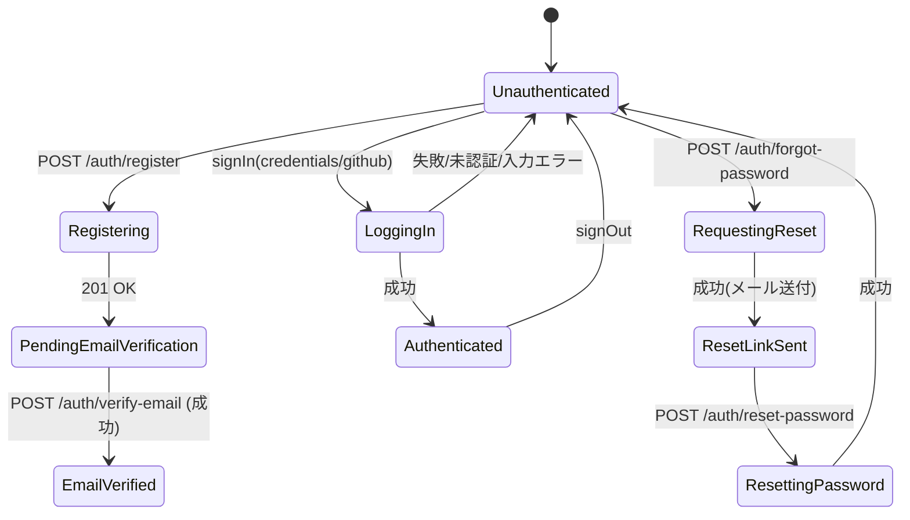
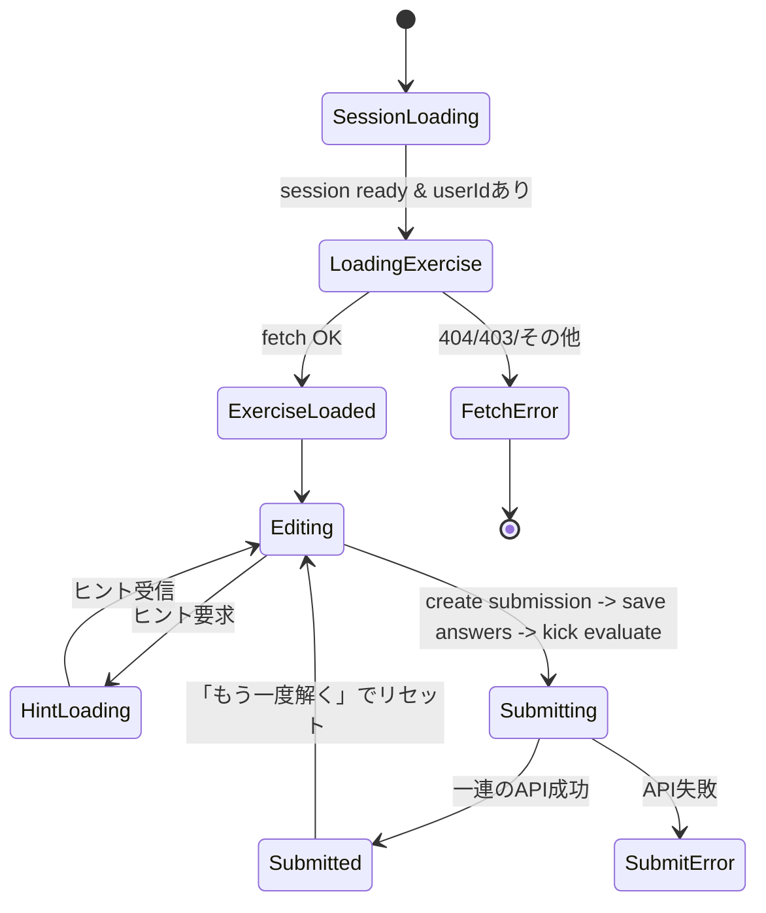
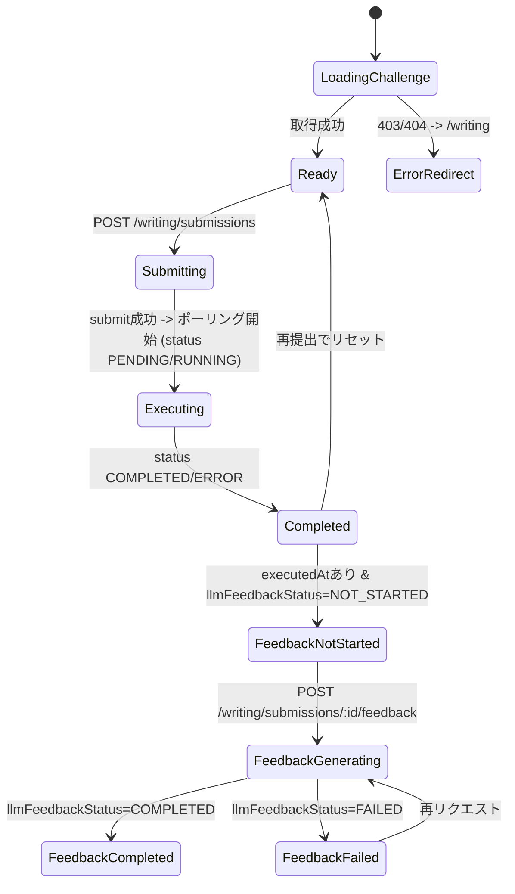

# Frontend State Machines

フロント主要フローの状態遷移図。UI実装と付き合わせるためのドキュメントです。

## Auth

## コードリーディング提出 (`app/(app)/exercises/[id]/page.tsx`)

## コードライティング提出/フィードバック (`app/(app)/writing/[id]/page.tsx`)

メモ:
- フロントはライティングの `llmFeedbackStatus` を `NOT_STARTED | GENERATING | COMPLETED | FAILED` と想定。
- コードリーディングのヒント生成は現在API接続済み、失敗時はエラーメッセージを表示。
